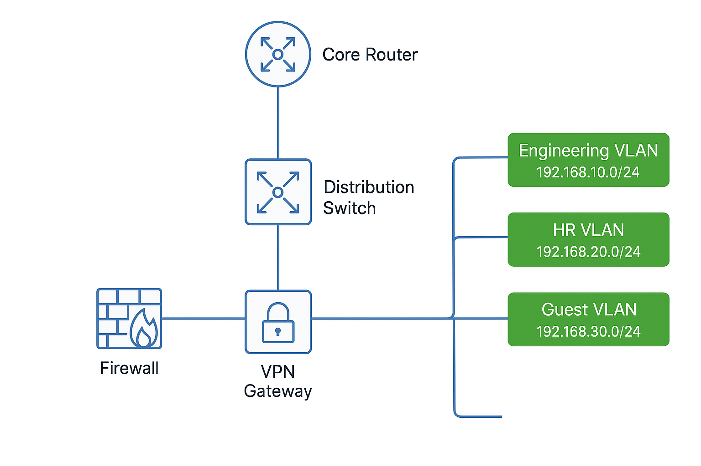

# Network Design

## 1. Topology
A small enterprise network simulating a standard enterprise office setup.

- **HQ (Silver Spring, MD)**
  - Core Router
  - Distribution Switch
  - Access Switch
  - Firewall
  - VPN Gateway
- **Departments**
  - Engineering VLAN (192.168.10.0/24)
  - HR VLAN (192.168.20.0/24)
  - Guest VLAN (192.168.30.0/24)
- **WAN Connectivity**
  - Site-to-Site VPN to remote branch
  - Internet access via ISP Router

---

## 2. Diagram

---

## 3. IP Addressing Plan
| Device         | Interface   | IP Address     | VLAN / Purpose       |
|----------------|------------|----------------|----------------------|
| Core Router    | G0/0       | 192.168.1.1    | Gateway              |
| Distribution Sw| VLAN10     | 192.168.10.1   | Engineering VLAN     |
| Distribution Sw| VLAN20     | 192.168.20.1   | HR VLAN              |
| Firewall       | Outside    | Public IP      | Internet Access      |
| VPN Gateway    | TUN0       | 10.10.10.1     | VPN Site Connection  |
